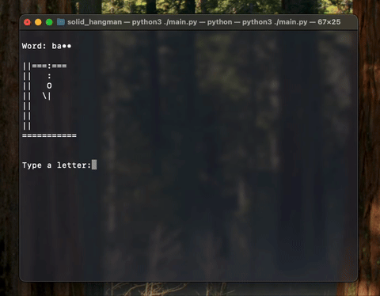
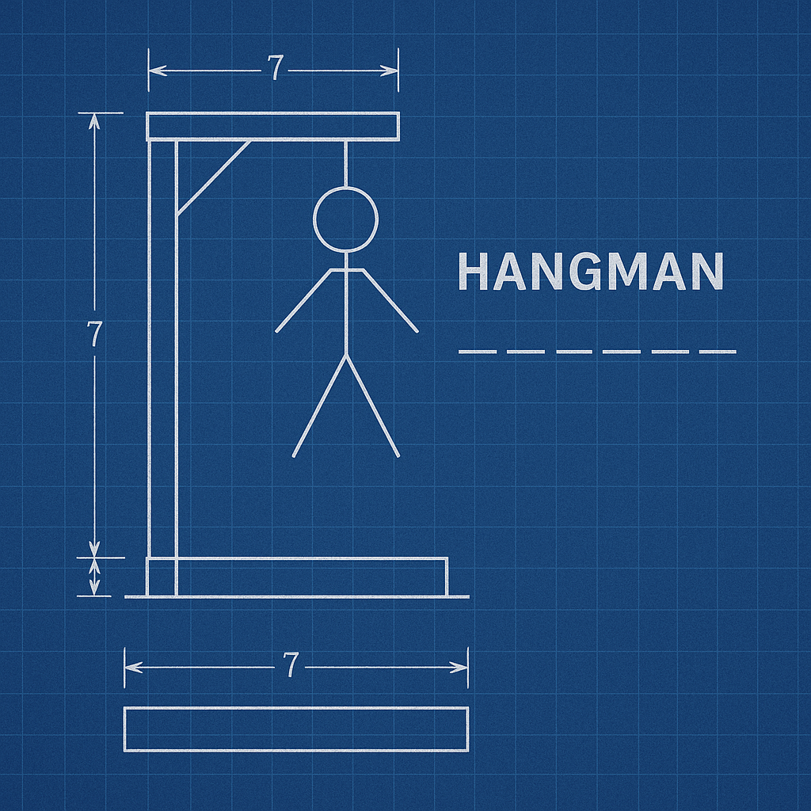

# Solid Hangman 🎯
*Or how to overengineer a simple terminal game*



Welcome to **Solid Hangman** — a project born from the desire to apply advanced programming principles to a simple terminal game, just for fun (and a little overengineering).

In this project, you'll find a clean, modular structure based on solid design principles (SOLID, separation of concerns, dependency injection) — all to run a humble Hangman game in your terminal.

> ⚠️ **Disclaimer**: Despite all the engineering, this project is intended purely for educational and entertainment purposes.
> We do not take any responsibility for damages if you attempt to run it in a production environment. (But if you do, good luck! 😅)

> 🧍**Note**: No stick figures were harmed in the making of this project.

## 📦 Project Structure


- `main.py`: The entrypoint to start the game.
- `hangman/`: Core package for the game.
  - `common/`: Shared components (canvas drawing, word loader).
  - `views/`: Screens and visual feedback (win, loss, prompts).
  - `domain.py`: Business logic for secret word and player guesses.
  - `controller.py`: Game flow manager.
  - `factory.py`: Responsible for wiring all components together.
- `data/`: Word lists for Easy and Hard modes.

## 🚀 How to Play




1. Clone this repository:
   ```bash
   git clone https://github.com/daviguides/solid_hangman.git
   cd solid-hangman
   ```

2. Run the game:
   ```bash
   python main.py
   ```

3. Choose your difficulty and try to guess the word before the Hangman is complete!

## 🎯 Why This Project?

This project was created to practice applying software architecture principles even in small, non-critical applications.  
Because sometimes, **building things the "right way" is more important than just building things.**

And sometimes, it's just for fun. 😄

## 📜 License

This project is licensed under the MIT License. Feel free to use, modify, and share it.
